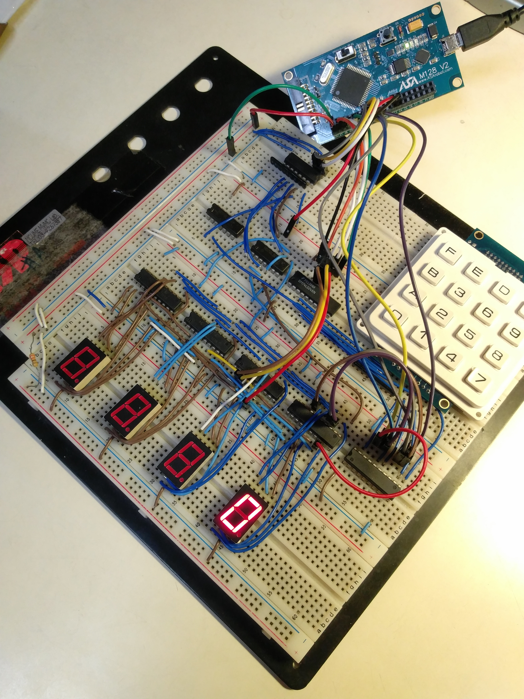

# NCU-Microcontroller
## 簡介
- **學校** : 國立中央大學
- **開課單位** : 機械工程學系
- **課程名稱** : 微控制器/微控制器實驗
- **授課教授** : 江士標 教授
- **修課時間** : 2019年09月~2020年06月
- **最終成績** : 100

## Lab介紹
1. **Hello World!**
    > 學習使用 Atmel Studio 7.0 編譯程式、燒錄至開發板，並透過人機介面 (HMI) 觀察程式輸出結果。  
    
    [Report-Lab1](./lab1/report.pdf)

2. **C程式執行流程控制語法使用**
    > 學習 C 語言的基礎流程控制語法，包括運算子 (operator)、條件判斷 (if-else, switch-case) 及迴圈 (for-loop, while-loop)。

    [Report-Lab2](./lab2/report.pdf)

3. **C語言函式建立及呼叫**
    > 學習 C 語言的函式建立與呼叫，包含傳值 (Call by Value) 與傳址 (Call by Reference) 的概念。

    [Report-Lab3](./lab3/report.pdf)

4. **C程式陣列及字串語法使用**
    > 學習 C 語言的陣列、字串及結構體 (Struct) 等資料結構之應用。

    [Report-Lab4](./lab4/report.pdf)

5. **單板電腦監控物理世界**
    > 學習如何透過微控制器 (MCU) 的 GPIO 接腳接收指撥開關訊號與驅動 LED，並於麵包板上完成基本電路連接。

    [Report-Lab5](./lab5/report.pdf)

6. **匯流排原理，住址解碼，緩衝器，三態**
    > 將 Lab 5 的電路升級，利用匯流排 (Bus) 的概念整合輸出／輸入訊號，並加入三態緩衝器 (3-state Buffer) 以簡化電路設計。

    [Report-Lab6](./lab6/report.pdf)
    
7. **編解碼，七節管顯示及鍵盤輸入掃瞄**
    > 將 Lab 6 的電路進一步改裝為 4x4 矩陣鍵盤與七段顯示器，並學習其掃描與解碼原理。

    [Report-Lab7](./lab7/report.pdf)
    
8. **電子計算機(輪詢式)**
    > 以 Lab 7 的硬體為基礎，透過輪詢 (Polling) 方式實作一台電子計算機。功能包含：透過 4x4 鍵盤輸入、四則運算、連續運算、負數處理、除以零的錯誤提示，以及按鍵防抖處理。

    [Report-Lab8](./lab8/report.pdf)

9.  **電子計算機(中斷式)**
    > 學習微控制器 (MCU) 的中斷 (Interrupt) 機制，並將 Lab 8 的輪詢式鍵盤掃描改為中斷式，以提升程式效率。

    [Report-Lab9](./lab9/report.pdf)

10. **ASA 介面卡**
    > 將自製的鍵盤與顯示器替換為現成的模組，並學習使用 SPI 通訊協定與模組進行溝通。

    [Report-Lab10](./lab10/report.pdf)

11. **時鐘**
    > 學習使用微控制器 (MCU) 內建的計時器 (Timer)，並結合 Lab 10 的模組，實作一個具備時間設定與鬧鐘功能的電子時鐘。

    [Report-Lab11](./lab11/report.pdf)

12. **步進馬達**
    > 學習驅動六線四相步進馬達的原理，透過 MCU 控制自製的 H 橋電路來完成馬達換相，並實現轉速控制功能。

    [Report-Lab12](./lab12/report.pdf)

13. **期末專題-自走車**
    > 整合 Lab 12 的步進馬達控制技術，搭配紅外線感測器，最終完成一台能夠沿著黑線自主行駛的循跡自走車。  
    這張地圖展示了自走車的行駛路徑。自走車從右上方的紅色區域出發，沿著黑線繞行一圈後，最終會回到同一個區域。途中的小型紅色區塊是檢查點，當車輛發生錯誤時，可以退回到最近經過的檢查點重新開始。
    

## 開發環境與需求
- **AVR-gcc**  
  [Atmel-Studio](https://www.microchip.com/en-us/tools-resources/develop/microchip-studio/gcc-compilers)
- **C4MLIB v3.7.0**
  
- **ASA_M128_V2(AVR ATMega128)**  
    [ASA官網](http://asarobot.tw/asa-m128/)

- **HMI**  
  [ASA_HMI_Data_Agent](https://gitlab.com/MVMC-lab/hmi/ASA_HMI_Data_Agent)

## 修課心得
這門課是中央大學機械系大一控制組的必修，由多位助教共同指導。課程包含 12 項連貫的實驗，並要求學生完成全部實驗後才能進行期末專題。為確保學習進度，課程採分組進行，學生可依能力選擇「實作組」或「考試組」，後者讓同學能透過筆試確保學分，設計相當彈性。

這是一門相當扎實的課程，內容涵蓋了 C 語言程式設計、MCU 周邊韌體操作 (GPIO/SPI/Interrupt)、麵包板電路實作等。雖然過程中經歷了無數次的除錯，但完成後收穫極大。特別是當親手打造的計算機成功運作時，那份成就感無可比擬。能夠順利完成這整門課，讓我對嵌入式系統有了更深的理解與自信。

最後，附上花費好幾個晚上才完成的 Lab8 計算機電路圖：  
